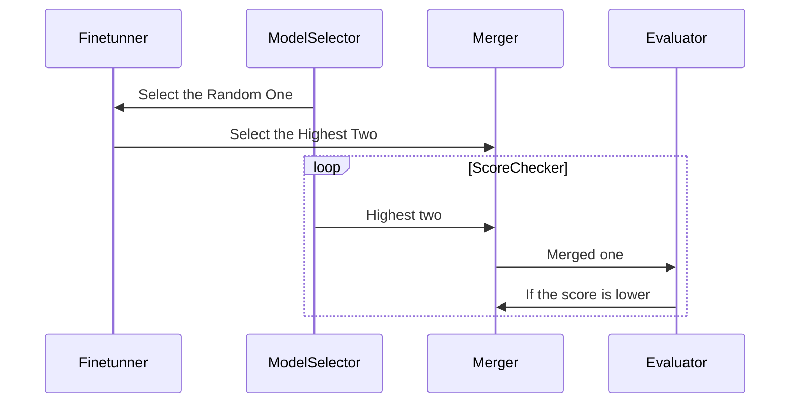

### May 4th 2024 - ranked 1st on the huggingface Open Llm Leaderboard
- This is a merged model. So you have to unckeck the "[X] Contains merge/moerge" checkbox above the list.

|             Metric              |Value|
|---------------------------------|----:|
|Avg.                             |81.28|

### free-evo-qwen72b-v0.8
- [model repository here](https://huggingface.co/freewheelin/free-evo-qwen72b-v0.8-re)   

### Method
- I was inspired by this [Sakana project](https://sakana.ai/evolutionary-model-merge/)

### Framework
[ ModelSelector ] > [ Finetunner ] > [ Merger ] > [ Evaluator ]   

### Process
Required two models with the same architecture.   

1. Original model > DPO + SFT > Gapped model   
2. SLERP Original one and Gapped one > Merged   
3. Evaluate > Merged   
* Fine-tune a specific evaluation part of the model if you need to increase the score for that part   
4. SLERP Merged one and Original One > Second Merged   
5. Evaluate Second Merged   
@ Continue until the average evaluation score is higher than the original one   

### Base Architecture 
- QWEN2

<!--
**javafa/javafa** is a ✨ _special_ ✨ repository because its `README.md` (this file) appears on your GitHub profile.

Here are some ideas to get you started:

- 🔭 I’m currently working on ...
- 🌱 I’m currently learning ...
- 👯 I’m looking to collaborate on ...
- 🤔 I’m looking for help with ...
- 💬 Ask me about ...
- 📫 How to reach me: ...
- 😄 Pronouns: ...
- ⚡ Fun fact: ...
-->
